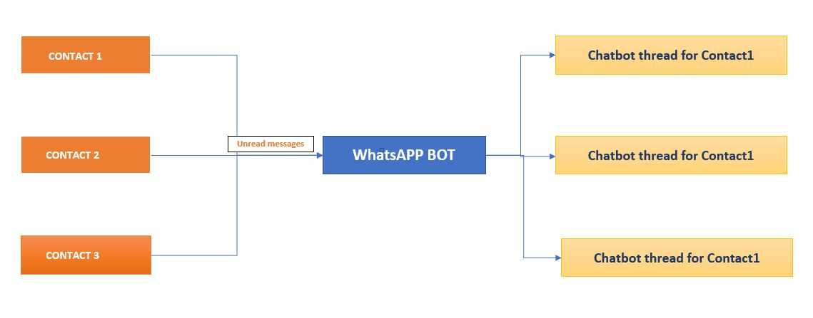

# WhatsAppBot
WhatsAppBot is a chatbot designed to answer unread messages in WhatsApp when owner is busy for some time.
At this moment, chat is designed to get set of question and answers stored in json (training_set.json) file and Q&A are very limited.

TODO: 
- Need to implement NPLK facebook/google to answer the questions preciously.
- Add doc for each of the functions
